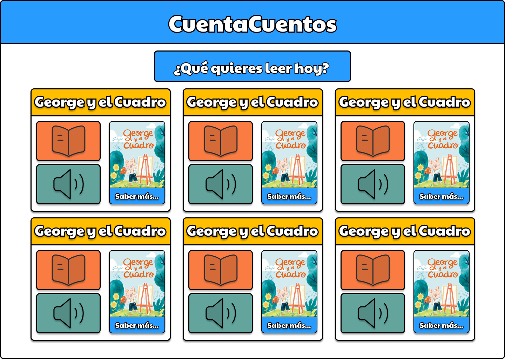
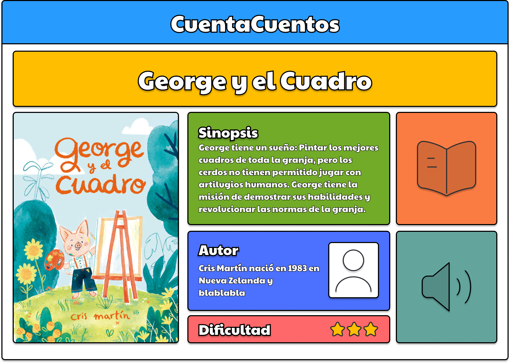
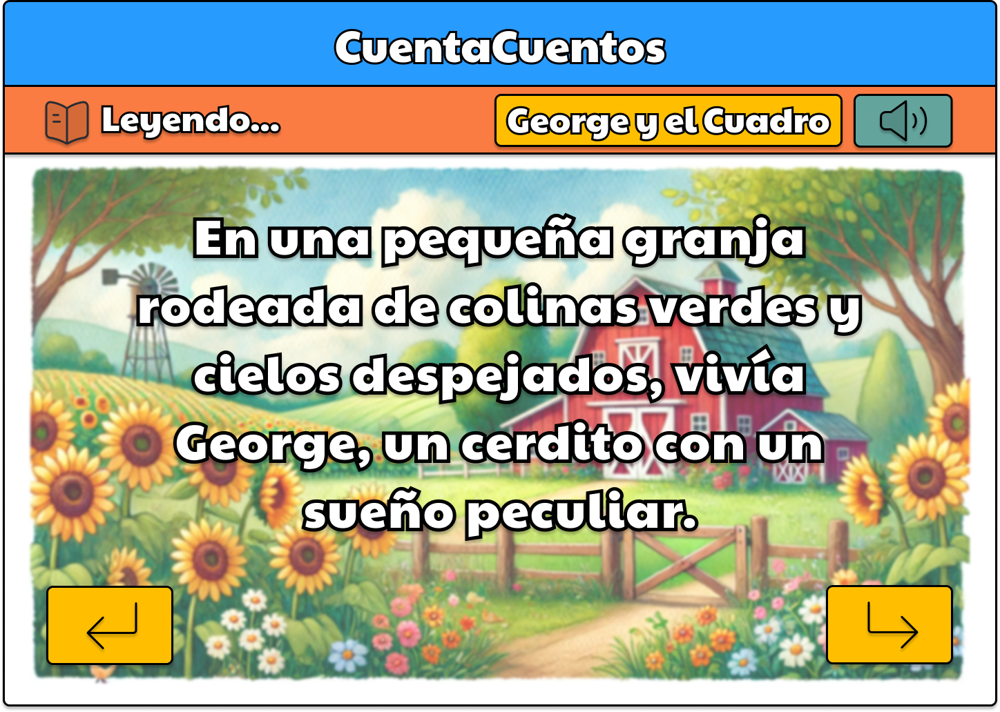
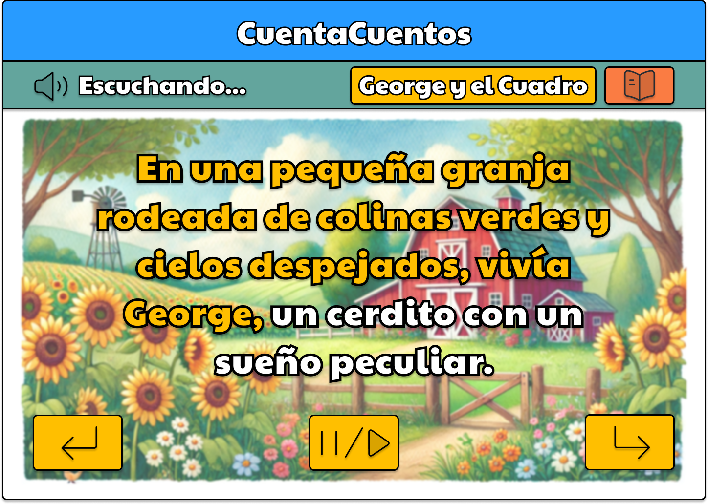

# 📚 Cuentacuentos

*Un pequeño prototipo de una gran biblioteca*

¡Hola! Somos Rafa y David, y queremos ponerte las cosas muy fáciles a la hora de leer las historias que te gustan. Este proyecto, aún en pañales, será tu **biblioteca de bolsillo**, y cuando lo completemos no tendrás ningún tipo de excusa para no utilizarla.

¿Te atreves a descubrir un poco más?

## 📖 Descripción del Proyecto

**Cuentacuentos** es una innovadora plataforma digital diseñada para llevar la magia de los cuentos a cada rincón del mundo. Actualmente en fase de prototipo, nuestra misión es hacer que la lectura y la narración de cuentos sean accesibles para todos, independientemente de sus habilidades o circunstancias. 

Imagínate una biblioteca donde no tienes que recorrer largos pasillos hasta encontrar lo que quieres, las páginas se adaptan a ti, y puedes sentarte a que te lean el cuento que más te gusta. ¿Lo tienes? **Cuentacuentos** combina tecnología y diseño accesible para asegurar que cada usuario encuentre su cuento perfecto y disfrute de la magia de la narración de una manera que se adapte a sus necesidades y preferencias, sin complicaciones.


## 📑 Tabla de Contenidos
- [Descripción del Proyecto](#-descripción-del-proyecto)
- [Funcionalidades Principales](#-funcionalidades-principales)
- [Tecnologías Utilizadas](#-tecnologías-utilizadas)
- [Escalabilidad y Futuras Mejoras](#-escalabilidad-y-futuras-mejoras)
- [Diseño final](#-diseño-final)
- [Licencia](#-licencia)
- [Contacto](#-contacto)

## 🚀 Funcionalidades Principales

- **Modo de Lectura:**
  - Visualización de cuentos con texto ampliable.
  - Navegación sencilla entre páginas.

- **Modo de Escucha:**
  - Reproducción de audio para cada línea del cuento.
  - Controles de reproducción (play/pause).

- **Accesibilidad Mejorada:**
  - Navegación completa por teclado.
  - Feedback visual para elementos interactivos.
  - Opción de convertir texto a audiolibro.

- **Interfaz Amigable:**
  - Diseño responsivo adaptable a diferentes dispositivos.
  - Controles intuitivos y fáciles de usar.

## 🛠 Tecnologías Utilizadas

- **Frontend:**
  - HTML5
  - CSS3 (con enfoque en accesibilidad)
  - JavaScript (para funcionalidades interactivas)

- **Herramientas y Librerías:**
  - [Google Fonts](https://fonts.google.com/) para tipografías personalizadas.
  - [Speech Synthesis API](https://developer.mozilla.org/es/docs/Web/API/SpeechSynthesis) para la funcionalidad de escucha.

## 📈 Escalabilidad y Futuras Mejoras

Aunque actualmente es un prototipo, **Cuentacuentos** está diseñado con una arquitectura escalable, y ya tenemos algunas ideas para las próximas versiones...

- **Añadir Más Cuentos:**
  - Fácil incorporación de nuevos cuentos gracias a la estructura de nuestro código.

- **Multilenguaje:**
  - Soporte para múltiples idiomas, ampliando el alcance a una audiencia global.

- **Interactividad Mejorada:**
  - Incorporación de ilustraciones interactivas y elementos multimedia.

- **Personalización de la Experiencia:**
  - Permitir a los usuarios guardar sus cuentos favoritos y seguir su progreso.

- **Optimización de Accesibilidad:**
  - Implementar modos y ajustes adicionales de accesibilidad según feedback de usuarios.

¿Se te ocurre alguna más? ¡Te escuchamos!

## 🎨 Diseño final


*Vista de la página principal de Cuentacuentos.*


*Vista de la página de información de un cuento concreto.*


*Ejemplo del modo de lectura.*


*Ejemplo del modo de escucha.*

## 📝 Contribuciones

Cuentacuentos es una parte fundamental de nuestro trabajo en la asignatura de Diseño, Evaluación y Desarrollo de Interfaces. Este proyecto es completamente abierto y estamos entusiasmados por descubrir cómo los usuarios pueden sorprendernos con sus ideas innovadoras al diseñar nuevas interfaces. ¡Tu contribución es más que bienvenida!

Cada modificación o ajuste que realices no solo nos ayudará a mejorar nuestro producto, sino que también nos permitirá adaptarlo perfectamente a tus necesidades y preferencias. Queremos que Cuentacuentos crezca y evolucione gracias a tus aportes, creando una experiencia única y personalizada para todos los usuarios.

- Pero no se cómo... 😖
+ ¡Mira y aprende! 😤

### 📌 Cómo Contribuir

1. **Fork el Repositorio** Crea una copia de este proyecto en tu cuenta de GitHub.
2. **Crea una Rama para tu Feature:**
    ```bash
    git checkout -b feature/nueva-funcionalidad
    ```
3. **Haz tus Cambios:** Realiza las modificaciones o mejoras que consideres necesarias. ¡No tengas miedo en tocar lo que necesites! Nuestro código está a salvo, así que no tengas miedo en trastear todo lo que quieras.
4. **Commit tus Cambios:**
    ```bash
    git commit -m "¡Nueva funcionalidad! Blablabla... (aquí nos explicas un poco qué cositas has estado haciendo)"
    ```
5. **Push a la Rama:**
    ```bash
    git push origin feature/nueva-funcionalidad
    ```
6. **Abre un Pull Request:** Comparte tus cambios con nosotros para que les echemos un vistazo, y si nos gustan igual te contratamos! (Es broma) (Pero pasarías a formar parte del proyecto) (Sería muy guay)

### 🌟 Beneficios de Contribuir

- **Aprendizaje Continuo:** Mejora tus habilidades en diseño y desarrollo de interfaces.
- **Colaboración:** Trabaja junto a otros entusiastas y profesionales del sector.
- **Impacto Real:** Ayuda a crear una herramienta accesible que beneficiará a usuarios de todo el mundo.


## 📝 Licencia

¡Sorpresa! No hay licencia. Tus aportaciones son más que bienvenidas para nuestro proyecto. Ganas tú, gano yo, ganamos todos.

¡No tengas miedo y lánzate a contribuir! Juntos, podemos hacer que la lectura y la narración de cuentos sean accesibles y mágicas para todo el mundo.

## 📫 Contacto

Para cualquier consulta o sugerencia, puedes contactarnos por aquí:
- Rafa: [rcabezali.inf@upsa.es](mailto:rcabezali.inf@upsa.es)
- David: [dfernandezca.inf@upsa.es](mailto:dfernandezca.inf@upsa.es)
